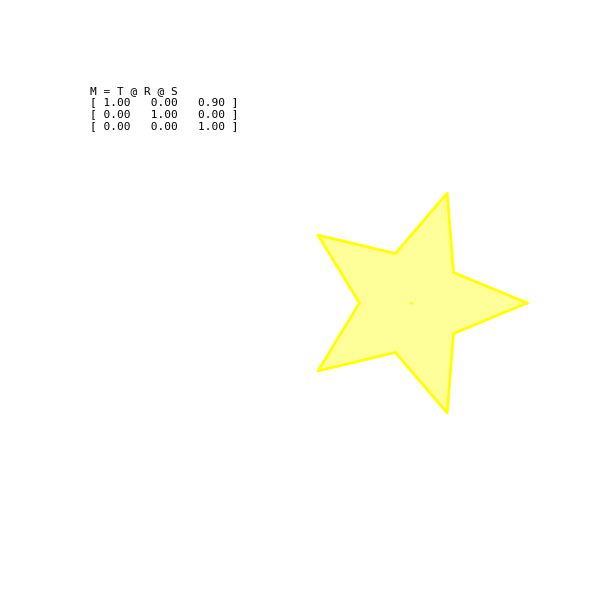

# **Taller 0 — Transformaciones Básicas en Computación Visual**


## **Fecha**
2025-09-12 


## **Objetivo del Taller**
Explorar y aplicar transformaciones geométricas (traslación, rotación, escala) en varios entornos visuales (Python, Processing, Three.js/React Three Fiber y Unity), generando evidencia visual de cada uno (GIFs/capturas) y documentar el proceso.


## **Conceptos Aprendidos**
- Transformaciones geométricas (escala, rotación, traslación)
- Composición de transformaciones (S → R → T)
- Animación dependiente del tiempo (millis(), frameCount, Time.time, clock)
- Exportación de animaciones como GIF
- Organización de proyectos y buenas prácticas de entrega


## **Herramientas y Entornos**
- **Python (Colab / Jupyter):** numpy, matplotlib, imageio
- **Processing:** IDE (P3D renderer)
- **Three.js / React Three Fiber:** 
- **Unity:** Unity (LTS)


## **Estructura del Proyecto**
```
2025-09-12_taller_0_transformaciones/
├── python/               # scripts / notebook + GIFs
├── processing/           # .pde + capturas/GIFs
├── threejs/              # proyecto Vite + src/
├── unity/                # Assets/ (Scripts + escena mínima)
├── .gitignore
└── README.md
```

## **Implementación**

## **NOTA IMPORTANTE: En dado caso que GIThub no renderice los GIF de cada resultado visual por tecnologia puede visualizarlo en cada carpeta por tecnologia**

## **Etapas realizadas comunes en cada tecnologia**
1. Preparación de la escena o figura base.
2. Implementación de funciones de transformación (traslación, rotación, escala).
3. Composición de transformaciones (matrices o transformaciones del motor).
4. Animación en función del tiempo 
5. Documentación y organización de resultados.


## **Python (Colab / Jupyter)**
### **Qué se hizo**
- Se generó una figura 2D (estrella) usando coordenadas polares.
- Se implementaron matrices homogéneas y la función que aplica la transformación compuesta M = T · R · S.
- Se generó una animación frame a frame y se exportó a GIF con `imageio`.

### **Código relevante**
```python
def create_star(points=5, inner_ratio=0.45):
    angles_outer = np.linspace(0, 2*np.pi, points, endpoint=False)
    angles_inner = angles_outer + np.pi/points
    r_outer = np.ones(points)
    r_inner = inner_ratio * np.ones(points)

    angles = np.empty(2*points)
    r = np.empty(2*points)
    angles[0::2] = angles_outer
    angles[1::2] = angles_inner
    r[0::2] = r_outer
    r[1::2] = r_inner

    x = r * np.cos(angles)
    y = r * np.sin(angles)
    pts = np.vstack((x, y))  # 2 x N
    return pts

def translation_matrix(tx, ty):
    return np.array([[1,0,tx],[0,1,ty],[0,0,1]])

def rotation_matrix(theta):
    c,s = np.cos(theta), np.sin(theta)
    return np.array([[c,-s,0],[s,c,0],[0,0,1]])

def scale_matrix(sx, sy):
    return np.array([[sx,0,0],[0,sy,0],[0,0,1]])

M = T @ R @ S
transformed = apply_transform(points, M)
```

### **Resultados visuales**




## **Unity (C#)**

### **Qué se hizo**
- Proyecto 3D mínimo con un `Cube` y un script `MoverRotarEscalar.cs`.
- El script aplica `transform.Translate()` (saltos aleatorios en X o Y cada `moveInterval`), `transform.Rotate()` con `Time.deltaTime` y `transform.localScale` con `Mathf.Sin(Time.time)`.

### **Código relevante**
```csharp
      // --- Traslación aleatoria por X o Y ---
        if (Time.time >= nextMoveTime)
        {
            // elige eje aleatorio: 0 = X, 1 = Y
            int axis = Random.Range(0, 2);
            Vector3 move = Vector3.zero;
            if (axis == 0) move = new Vector3(moveDistance, 0, 0);
            else move = new Vector3(0, moveDistance, 0);

            transform.Translate(move, Space.World);
            nextMoveTime = Time.time + moveInterval;
        }

        // --- Rotación constante ---
        transform.Rotate(Vector3.up * rotationSpeed * Time.deltaTime);

        // --- Escalado oscilante ---
        float scale = baseScale + Mathf.Sin(Time.time) * scaleAmplitude;
        transform.localScale = new Vector3(scale, scale, scale);
    }
```

### **Resultados visuales**


## **Three.js + React Three Fiber**

### **Qué se hizo**
- Proyecto Vite + React con `@react-three/fiber`.
- Componente `AnimatedMesh` que usa `useFrame` para mover sobre una traslación circular, rotar sobre el propio eje y escalar el mesh.
- `OrbitControls` para navegación.

### **Código relevante**
```jsx
export default function AnimatedMesh({
  radius = 2,        // radio de la trayectoria circular
  speed = 1,         // velocidad angular
  baseY = 0,         // altura base del cubo
  position = [0, 0, 0], // centro de la trayectoria
}) {
  const mesh = useRef()

  useFrame((state, delta) => {
    const t = state.clock.getElapsedTime() * speed

    // rotación sobre el propio eje
    mesh.current.rotation.x += 0.6 * delta
    mesh.current.rotation.y += 1.2 * delta

    // traslación circular en plano XZ
    mesh.current.position.x = position[0] + Math.cos(t) * radius
    mesh.current.position.z = position[2] + Math.sin(t) * radius
    mesh.current.position.y = baseY

    // escalado suave 
    const s = 1 + Math.sin(t) * 0.25
    mesh.current.scale.set(s, s, s)
  })
})
```

### **Resultados visuales**


## **Processing (P3D)**

### **Qué se hizo**
- Se realizó un sketch 3D con un cubo que rota, se traslada en trayectoria circular/ondulada y escala cíclicamente con uso de `pushMatrix()` / `popMatrix()` para aislar transformaciones.

### **Código relevante**
``` java
  // cubo animado
  pushMatrix();
    translate(width * 0.5 + x, height * 0.5 + y, z);
    rotateX(rx);
    rotateY(ry);
    rotateZ(rz);
    scale(s);
    specular(255);
    shininess(20);
    fill(220, 120, 60);
    stroke(34);
    strokeWeight(1.5);
    box(baseBoxSize);
  popMatrix();

  // plano de suelo
  pushMatrix();
    translate(width * 0.5, height * 0.5 + 240, 0);
    rotateX(HALF_PI); 
    noStroke();
    fill(16, 20, 30);
    rect(0, 0, 1200, 1200);
  popMatrix();

```
**Puntos clave**
- Renderer: `size(w, h, P3D)`
- Tiempo: `millis()` o `frameCount`
- Suelo: se usó `rect()` rotado para simular un plano.

### **Resultados visuales**


## **Reflexión Final**
Con este taller reforcé la noción de composición de transformaciones (S→R→T) y la importancia de sincronizar animaciones con el tiempo del entorno (millis/Time.time/clock) además reforce la idea de que con los conceptos básicos aprendidos estos se pueden utilizar en la técnologia que sea, que se aplica la misma lógica entre Python, Processing, R3F y Unity, mostrandome las similitudes conceptuales y las diferencias prácticas (APIs y unidades de tiempo).

## Contribuciones (qué hice yo)
- Implementé la animación Python (estrella) y exporté un GIF.
- Implementé el sketch Processing (cubo 3D) y corregí incompatibilidades.
- Implementé el componente React Three Fiber (AnimatedCube).
- Implementé el script Unity (MoverRotarEscalar).
- Documenté la estructura, el `.gitignore` y el proceso de entrega.


## Checklist de Entrega
- [✅] Carpeta `2025-09-11_taller_0_transformaciones/`
- [✅] Código limpio y funcional en cada carpeta
- [✅] GIFs para representar cada resultado
- [✅] README completo y claro (este archivo)
- [✅] Commits descriptivos en inglés


