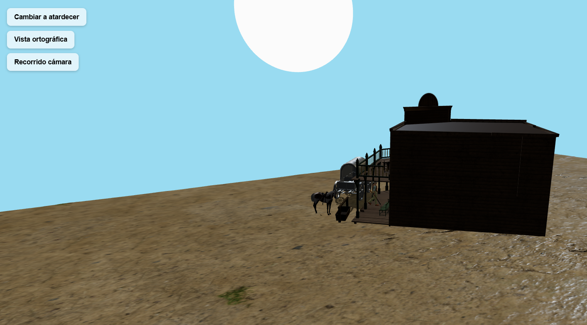
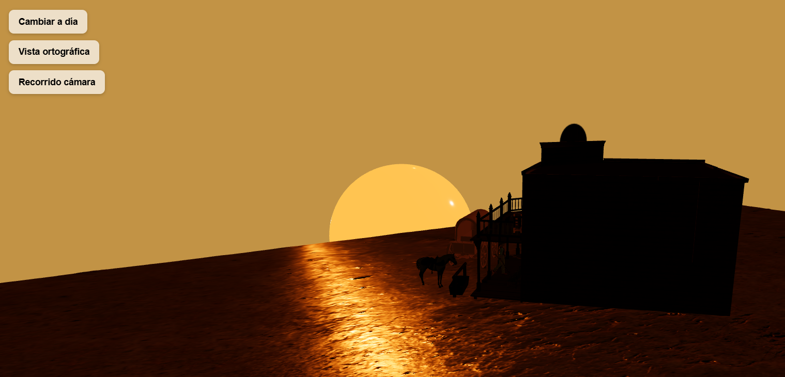

# **Taller: Materiales por Iluminación y Modelos de Color en un Mundo Virtual con Three.js**


## **Fecha**
2025-10-23


## **Objetivo del Taller**
Crear un mundo virtual estilo “Medio Oeste” (saloon, caballo, cowboy, carreta) con React Three Fiber donde la apariencia de los materiales responda a la iluminación y a un modelo de color. El proyecto incluye: carga de GLB, texturas PBR (ground), un sol con material PBR, un parche procedural, alternancia de cámaras, animaciones de cámara y luz, y una ficha técnica con parámetros clave.


## **Conceptos Aprendidos**
- Materiales PBR: uso de `roughness`, `metalness`, `normalMap` y `roughnessMap` para simular superficies realistas.
- Texturas procedurales: generación dinámica de patrones como damero y ruido.
- Iluminación tridimensional: configuración de esquemas con key, fill, rim y ambient light, incluyendo presets (día/atardecer).
- Cámaras perspectiva y ortográfica: implementación de alternancia y comprensión de sus efectos visuales.
- Animación dependiente del tiempo: uso de `useFrame`, `delta`, `lerp` y trayectorias controladas con `ref` y `Vector3`.
- Importación y organización de modelos GLB: normalización de escala y distribución espacial de acuerdo al mundo creado.
- Modelo de color: definición de paleta en RGB y HSV, y aplicación de contraste perceptual con CIELAB.


## **Herramientas y Entornos**
- **Python (Colab / Jupyter)** 
- **Three.js / React Three Fiber** 


## **Estructura del Proyecto**
```
2025-10-03_taller_1_materiales_iluminacion_color\threejs\taller_1
├── glb_models/
├── textures/
├── renders/
├── threejs/taller_1
  ├─public/
  ├─src/
    ├─ App.jsx
    ├─ Ground.jsx
    ├─ Horse.jsx
    ├─ Saloon.jsx
    ├─ Wagon.jsx
    ├─ Cowboy.jsx
    ├─ Sun.jsx
    ├─ ProceduralPatch.jsx
    ├─ CameraToggle.jsx
    ├─ CameraPath.jsx
    ├─ LightPresets.jsx
    ├─ main.jsx
    └─ index.css
└── README.md
```

## **Implementación**

## **Breve explicación del mundo creado (concepto)**

- **Escena ambientada en un pueblo del viejo oeste con:**

- Saloon o edificio (arquitectónico),
- Un caballo (orgánico),
- Una carreta o vagón (utilitario),
- Un vaquero,
- Un piso tipo arena con texturas PBR reales + parche procedural.
- Un sol con texturas,cambio de intensidad y color.
- Una "alfombra" para entrar al edificio a tráves de procedural patch.





En este mundo la escena permite alternar entre día y atardecer, ver el efecto en los materiales (sobretodo en el vagon y el piso), alternar cámaras (perspectiva / ortográfica) y ejecutar un recorrido de cámara corto.

---
## **Modelos GLB usados (nombre, fuente y modificaciones)**

### **Fuentes (Sketchfab):**
1. Cowboy: https://sketchfab.com/3d-models/cowboy-with-winchester-carbine-3d-printable-9b2b9abdad984a708527113448ad9ab8
2. Horse: https://sketchfab.com/3d-models/realistic-horse-3d-model-free-download-b81fdf826b92456d8b0351853297448d
3. Saloon: https://sketchfab.com/3d-models/wild-west-saloon-7e24d622bfda479986ec6327568ddf65
4. Wagon: https://sketchfab.com/3d-models/wild-western-wagon-0fbafa2f474f4bb0bc6506d2f0431469

### **Modificaciones realizadas**

#### `horse.glb`
- No modificado en texturas.
- Se cargó con `useGLTF`, se escaló y posicionó con `scale={0.14}`.
- Sombras activadas (`castShadow`, `receiveShadow`).
- Animación: se reproduce el clip `idle` disponible mediante `useAnimations`.

#### `cowboy.glb`
- No modificado en texturas.
- Escalado y posición aplicados con `scale={0.015}`.

#### `saloon.glb`
- Se ocultó el plano interno incluido en el GLB (para evitar duplicar el suelo) usando:
  ```js
  scene.traverse(obj => {
    if (obj.name.includes('plane')) obj.visible = false;
  });

#### `wagon.glb`
- Material reemplazado: se creó un `MeshStandardMaterial` con:
  - `color: '#555555'`
  - `roughness: 0.6`
  - `metalness: 0.8`


- El material se anima en `useFrame()` para interpolar `color`, `roughness` y `metalness` segun si es día o noche, segun ello es más cálido o no.

#### `ground` (texturas importadas desde AmbientCG con un asset llamado `Ground088`)
- Se aplicaron mapas PBR:
  - `map`
  - `normalMap`
  - `roughnessMap`
  - `aoMap`
  - `displacementMap`
- `displacementScale` configurado en `0.25`.


## **Iluminación (esquema aplicado)**

### Tipos de luz

- **Ambient Light** — intensidad y color derivados del preset HSL.
- **Key Light** — direccional principal, controlada desde `Sun.jsx`, un sol animado que cuando es el atardecer se esconde y su intensidad y color cambian dependiendo.
- **Fill Light** — direccional secundaria para rellenar sombras (`LightPresets`).
- **Rim Light** — luz direccional trasera para realzar siluetas (`LightPresets`).

### Presets de iluminación

#### Durante el día
- **Sky HSL:** `H=0.55`, `S=0.7`, `L=0.6` (azul claro)
- **Ambient:** claro, intensidad `0.5`
- **Key:** blanca, intensidad `~1.2`

#### Durante el atardecer
- **Sky HSL:** `H=0.08`, `S=0.8`, `L=0.3` (anaranjado)
- **Ambient:** más cálido, intensidad `~0.25`
- **Key:** anaranjada, intensidad reducida


## **Materiales y parámetros clave (PBR)**
 
PBR dinámico se aplica explícitamente a:
- **Wagon** (reemplazo + animación)
- **Ground** (usa mapas PBR que vienen con el asset)
- **Sun** (material PBR para la malla del sol)  
Los demás modelos mantienen sus materiales originales incluidos en los GLB.

---
Más a detalle:
### **Ground (`Ground.jsx`)**
- `displacementScale`: `0.25` - desde donde le damos relieve al terreno
- `roughness` en material: `1` (base) — los mapas de roughness controlan variaciones locales.

### **Wagon (`Wagon.jsx`)**

- **Base:**  
  `MeshStandardMaterial({ color: '#555555', roughness: 0.6, metalness: 0.8 })`

- **Dinámica:**
  - `mat.color.lerp(targetColor, 0.05)`  
    `targetColor = #b0b0b0` (día) o `#ffb380` (atardecer)
  - `roughness` suavemente hacia `0.4` (día) o `0.85` (atardecer)
  - `metalness` hacia `0.7` (día) o `0.2` (atardecer)
  - `envMapIntensity` interpolada (`1.2` día, `0.3` atardecer)


### **Sun (`Sun.jsx`)**

- **Malla:** `meshStandardMaterial` con:
  - `emissive` color: `#fdeb84ff` (día), `#ff7b00` (atardecer)
  - `emissiveIntensity`: `5` (día), `2` (atardecer)
  - `metalness`: `0.6`
  - `roughness`: `0.1` (brillante PBR)  


## **Shaders procedurales aplicados**

**Componente:** `ProceduralPatch.jsx`


### **Checker**

- Función utilizada: `makeChecker(size=512, cells=12, colA='#7b5b3a', colB='#c9a877')`
- Resultado: `CanvasTexture` generado dinámicamente y aplicado como `map`.

### **Noise (ruido)**

- Función utilizada: `makeNoise(size=512)`
- Tipo: ruido aleatorio simple generado en canvas.
- Configuración:
  - Envolvente: `RepeatWrapping`
  - Repetición: `repeat.set(4, 4)`
- Uso: aplicado como `roughnessMap` o como `alphaMap` para variar el brillo superficial.
###  **Parámetros clave**

- Tamaño del patch por defecto: `[4, 4]`
- Checker `cells`: `12` (ajustable para modificar el tamaño de los cuadros)
- Noise `repeat`: `4x4`


### **Justificación técnica**

El shader tipo damero fue utilizado para diferenciar visualmente la zona del `wagon`, simulando una alfombra de entrada al local. El ruido se aplicó para introducir rugosidad superficial variable, mejorando la respuesta bajo distintas condiciones de iluminación.


## **Cámaras**

- **PerspectiveCamera (default):** posición `position={[40, 10, 25]}` (definida en `CameraToggle.jsx`), `fov=50`. Usada para visualización natural.


- **OrthographicCamera:** posición `position={[0, 8, 35]}`, `zoom=60`. Útil para las vistas arquitectónicas de todos los elementos.


- **Alternancia:** botón en la UI que modifica `isOrtho` y activa la cámara correspondiente mediante `makeDefault`.

- **Recorrido:** `CameraPath.jsx` mueve la cámara en un arco circular para mostrar interacciones entre todos los modelos, en general el entorno construido.


## **Animaciones**


- **Sun:** movimiento orbital suave (`useFrame`) que modifica posición y color, cuando es día o atardecer afectando la iluminación general de la escena.

- **Wagon:** interpolaciones en `color`, `roughness` y `metalness` durante el ciclo día → atardecer, simulando pérdida de brillo y transición a una apariencia más mate.

- **Horse:** se reproduce la animación que tenia el modelo por defecto de `idle` incluida en el GLB mediante `useAnimations`.

- **CameraPath:** recorrido corto con `lerp` de posición para suavizar el movimiento, y `lookAt` al caballo como punto focal.

## **Modelo de color**

El modelo de color utilizado fue **HSL** (*Hue, Saturation, Lightness*), seleccionado por su intuitiva separación de tono, saturación y luminosidad, lo que facilita la interpolación cromática continua y el ajuste de atmósferas en tiempo real.

Este modelo permitió controlar tanto la **tonalidad del cielo** como la **temperatura general de la iluminación ambiental**, logrando transiciones suaves entre condiciones diurnas y de atardecer.

- **Escena de día:** `HSL(0.55, 0.7, 0.6)` → azul claro, que aporta frescura y resalta materiales metálicos y superficies de alto albedo.
- **Escena de atardecer:** `HSL(0.08, 0.8, 0.3)` → naranja cálido, que enfatiza reflejos difusos y genera un ambiente más dramático y contrastado.

La paleta fue diseñada buscando un **contraste perceptual equilibrado** entre materiales y entorno.

Aunque la manipulación principal se realizó en **HSL**, las decisiones cromáticas se guiaron por principios del espacio **CIELAB**, procurando mantener diferencias **ΔE perceptibles (>10)** entre elementos cercanos, garantizando una adecuada legibilidad visual y separación de planos.


## **Ficha tecnica**

### **Modelos (.glb)**

- **`horse.glb`**
  - **Fuente:** Sketchfab
  - **Escala:** `0.14`
  - **Rotación:** `rotation={[0, Math.PI / 1.5, 0]}`
  - **Materiales:** originales incluidos en el GLB

- **`cowboy.glb`**
  - **Fuente:** Sketchfab
  - **Escala:** `0.015`
  - **Materiales:** originales incluidos en el GLB

- **`saloon.glb`**
  - **Fuente:** Sketchfab
  - **Escala:** `0.25`
  - **Modificación:** oculto el plano interno (`obj.name.includes('plane') → visible = false`)

- **`wagon.glb`**
  - **Fuente:** Sketchfab
  - **Escala:** `1.3`
  - **Material:** reemplazado por `MeshStandardMaterial` animado dinámicamente (`color`, `roughness`, `metalness`)

---

### **Ground**

- **Texturas PBR aplicadas:**
  - `Color`, `NormalGL`, `Roughness`, `AO`, `Displacement`
- **Parámetros:**
  - `displacementScale: 0.25`
  - **Tamaño del plano:** `55 × 90`
  - **Subdivisiones:** `512 × 512`

---

### **Iluminación**

- **Ambient Light:** color variable según preset (`HSL`)
- **Key Light:** definida en `Sun.jsx` como `directionalLight` con sombras
- **Fill / Rim Light:** configuradas en `LightPresets.jsx`

---

###  **Shaders Procedurales**

- **Componente:** `ProceduralPatch.jsx`
- **Tipos aplicados:**
  - **Checker:** `cells = 12`
  - **Noise:** `repeat = 4 × 4`
- **Usos:** como `map` y `roughnessMap` en materiales seleccionados

---

### **Cámaras**

- **PerspectiveCamera**
  - `fov = 50`
  - Vista por defecto para navegación
- **OrthographicCamera**
  - `zoom = 60`
  - Vista plana para composición arquitectónica

---


## **Resultados visuales**

### **Capturas de pantalla obligatorias de la escena**


### **GIFs animados obligatorios o video corto mostrando:**

- Cambio de materiales bajo distinta luz

- Alternancia entre cámara perspectiva y ortográfica

- Movimiento de luces y objetos con shaders procedurales activos


**También puede ver el video corto bajo el nombre mundo_virtual.mp4**


## **Reflexión Final**
Este taller me permitió consolidar conocimientos clave sobre la interacción entre materiales, iluminación y modelos de color en entornos tridimensionales. A través de la implementación de un mundo virtual estilo “Medio Oeste”. Además aprendí que las animaciones deben tener sentido con el tiempo del entorno y el estado de la escena. Este enfoque me permitió animar propiedades físicas como `roughness`, `metalness` y `color`, logrando transiciones suaves entre condiciones de iluminación diurna y de atardecer.


