# Introducción a la Actividad

La actividad tiene como propósito analizar en profundidad algunos de los algoritmos y métodos fundamentales utilizados actualmente en visión por computador, particularmente aquellos relacionados con la captura, representación y procesamiento de información visual en entornos tridimensionales. A través del estudio de los artículos proporcionados, se busca comprender cómo estos algoritmos permiten resolver problemas como la representación del entorno completo, la localización y el mapeo simultáneos, y la percepción omnidireccional.


## **Artículo #1: Esfera_a_Plano_Geometría_360-2-15**

### **1. Problema que aborda**

El artículo estudia el problema fundamental de cómo capturar y representar una escena esférica completa en un formato plano y digital, ya que las cámaras tradicionales tienen un campo de visión limitado y no pueden registrar la totalidad del entorno en un solo instante. Por lo cual, la tecnología 360° aborda esto resolviendo la transición de un espacio esférico —un campo visual completo alrededor de un punto— hacia una imagen plana que pueda almacenarse, procesarse y visualizarse sin perder información esencial y gestionando las distorsiones inevitables que surgen en la proyección.

El problema incluye:
- Modelar la captura de la esfera visual completa mediante un sistema óptico adecuado.  
- Proyectar esa esfera en un plano mediante un método eficiente y utilizable.  
- Minimizar deformaciones, redundancias de píxeles y pérdida de información.  
- Integrar la captura real basada en lentes “ojo de pez” y fusionar las imágenes mediante procesos de stitching.

---

### **2. Flujo de operación (pipeline)**

#### Modelo de cámara esférica
La captura se basa en un modelo ideal donde la cámara se ubica en el centro de una esfera unitaria, aqui cada punto del entorno 3D se proyecta como un rayo que intersecta la superficie de la esfera, este rayo se describe mediante coordenadas esféricas: azimut para el ángulo horizontal y elevación para el ángulo vertical, permitiendo describir toda la escena sin puntos ciegos.

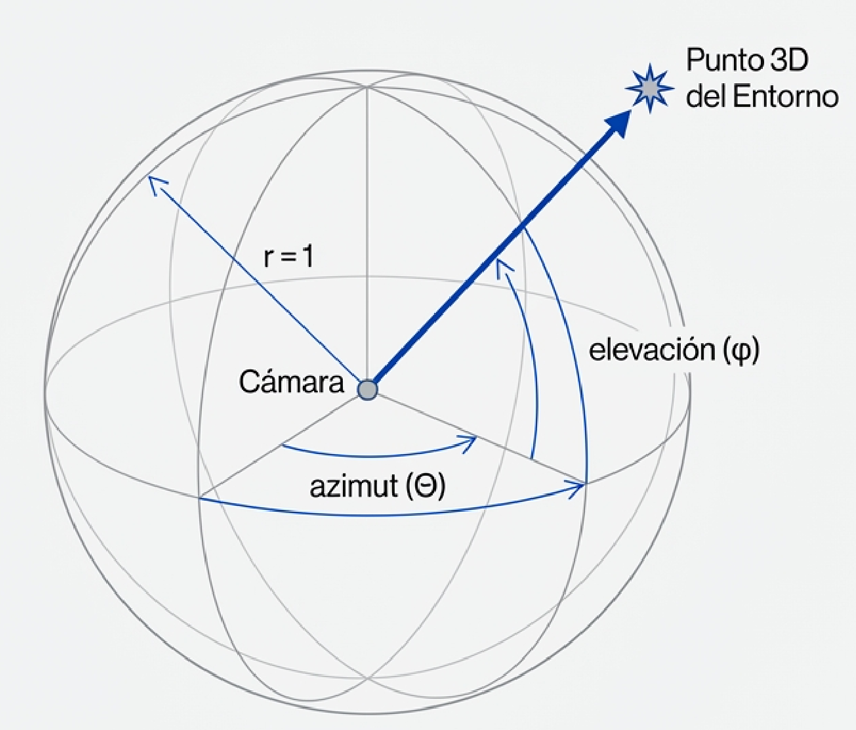

#### Proyección equirectangular
Una vez representada la escena sobre la esfera, se utiliza la proyección equirectangular para “desenrollar” la información hacia un plano, es entonces donde el ángulo de azimut se asigna directamente al eje horizontal de la imagen y la elevación al eje vertical. Esta conversión produce una imagen rectangular de relación 2:1, este mapeo lo convierte en el estándar más difundido, especialmente en software y plataformas de video 360°.

#### Identificación de la distorsión polar
La proyección equirectangular genera distorsiones severas cerca de los polos, donde las áreas se estiran horizontalmente, aqui se presenta una pérdida de eficiencia en la distribución de píxeles y zonas redundantes donde existe menos contenido informativo. Esta limitación motiva el uso de proyecciones alternativas.

#### Proyección cúbica
Para reducir la distorsión, la esfera se proyecta conceptualmente en un cubo. La escena se distribuye sobre seis caras, que luego pueden ser desplegadas en el plano, el formato mejora la eficiencia del muestreo y es ampliamente utilizado en gráficos 3D asi como renderizado en tiempo real. Aun así, introduce deformaciones en los bordes de las caras y variaciones de densidad de muestreo. 


#### Captura real mediante lentes ojo de pez
Las cámaras comerciales no capturan directamente la esfera completa, sino que utilizan dos lentes opuestas con campos de visión superiores a 180°. Cada lente produce una imagen circular hemisférica.

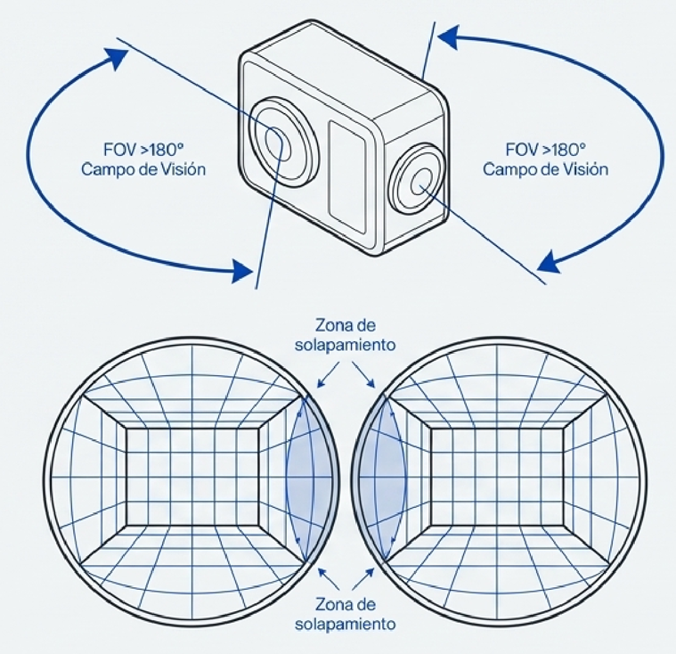

#### Stitching
El proceso de stitching alinea las dos imágenes, corrige la distorsión de las lentes y fusiona los hemisferios en una única imagen esférica continua. El resultado final es, típicamente, una imagen en formato equirectangular. En dispositivos modernos el proceso se realiza en tiempo real.

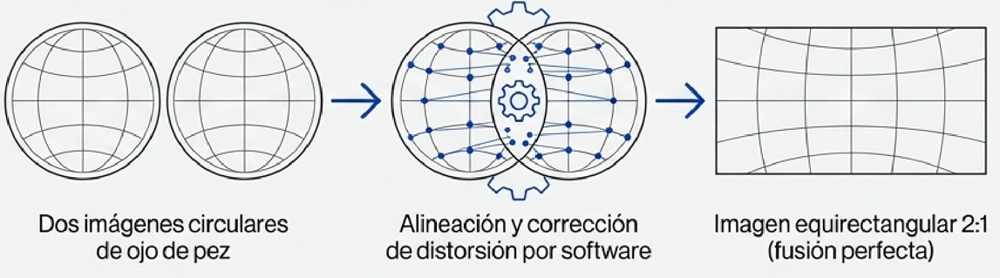

---

### **3. Ventajas frente a técnicas tradicionales**

La geometría 360° supera las limitaciones del modelo pinhole tradicional al capturar la totalidad del entorno sin necesidad de mover la cámara. Esto ofrece una percepción más completa y robusta para tareas humanas y automáticas.

Las ventajas principales incluyen:
- Registro completo del entorno sin puntos ciegos.  
- Mayor disponibilidad de información visual por unidad de captura.  
- Robustez para sistemas de visión por computador, especialmente en seguimiento, mapeo y odometría.  
- Mejor desempeño en aplicaciones inmersivas donde el usuario requiere libertad total de orientación.  
- Adecuación para mapeo urbano, navegación autónoma y reconstrucciones a gran escala.  
- Compatibilidad con flujos de procesamiento modernos gracias a proyecciones como cubemap, que optimizan el uso de píxeles y el renderizado en GPU.

---

### Diagrama de Flujo del Proceso Completo

```text
              Inicio
                |
                v
     Representación del entorno 3D
                |
                v
     Proyección de rayos sobre esfera
       (modelo de cámara esférica)
                |
                v
        Selección del método de
            proyección a plano
                |
      -----------------------------
      |                           |
      v                           v
Proyección Equirectangular   Proyección Cúbica
 (mapeo directo θ, φ)         (proyección a 6 caras)
      |                           |
      v                           v
   Imagen 2D con             Imagen 2D con
  distorsión polar        menor distorsión polar
                |
                v
  Captura real mediante doble
          lente ojo de pez
                |
                v
     Obtención de dos imágenes
      hemisféricas circulares
                |
                v
            Stitching
   (alineación, corrección y fusión)
                |
                v
     Imagen esférica completa
          en formato plano
                |
                v
              Fin

```


## **Artículo #2: ORB – El Algoritmo que Dio “Visión en Tiempo Real” a la Robótica y la Realidad Aumentada**

### **1. Problema que aborda**

El artículo analiza uno de los desafíos centrales en visión por computador y robótica: **cómo un sistema autónomo puede detectar, describir y rastrear puntos de interés en una escena** de manera rápida, robusta y apta para tiempo real.
Este problema es fundamental para tecnologías como SLAM (Simultaneous Localization and Mapping), odometría visual, realidad aumentada y reconstrucción 3D.

Antes de ORB existían algoritmos altamente robustos como **SIFT** y **SURF**, capaces de detectar características invariantes a escala, rotación y cambios de iluminación. Sin embargo, estos métodos tenían dos limitaciones críticas:

* **Eran demasiado lentos** para aplicaciones en tiempo real.
* **Estaban sujetos a patentes**, lo cual impedía su uso libre en aplicaciones comerciales.

Por lo tanto, el problema central era:

* Diseñar un algoritmo **tan robusto como SIFT/SURF**,
* **mucho más rápido**,
* y **libre de restricciones de propiedad intelectual**.

ORB surge como la solución, combinando y mejorando dos técnicas previas: **FAST** (para detección de puntos clave) y **BRIEF** (para descripción de características), añadiendo invariancia a la rotación y estabilidad en el matching.


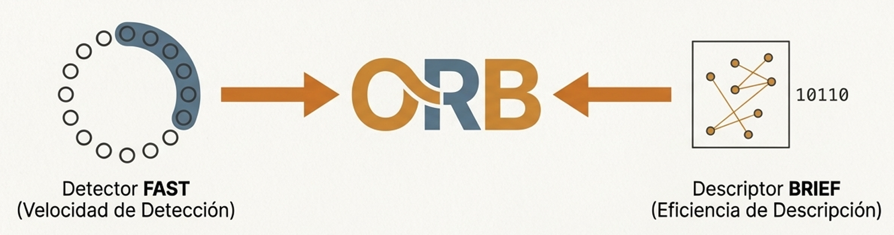

---

### **2. Flujo de operación (pipeline)**

#### **Detector FAST: Detección extremadamente rápida de esquinas**

ORB inicia utilizando **FAST**, que identifica esquinas evaluando la intensidad de un píxel respecto a los 16 píxeles de un círculo alrededor de él.

El proceso:

1. Seleccionar un círculo de 16 píxeles alrededor del punto.
2. Comparar la intensidad del píxel central con los del círculo.
3. Usar un umbral de brillo para decidir contraste significativo.
4. Si existen ≥ N píxeles consecutivos más brillantes u oscuros, se detecta una esquina.

Este método es atractivo porque evita cálculos complejos y usa solo comparaciones de intensidad.


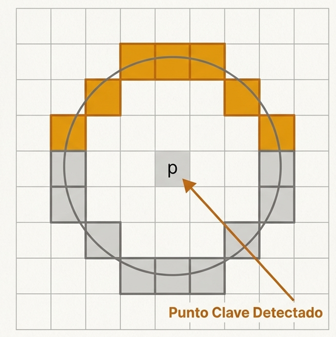

---

#### **BRIEF: Creación del descriptor binario**

Una vez detectada una esquina, ORB emplea **BRIEF** para generar un descriptor compacto en forma de cadena binaria.

Flujo de BRIEF:

1. Seleccionar un parche alrededor del punto clave.
2. Elegir pares de píxeles dentro del parche (por ejemplo 256 pares).
3. Comparar intensidades de cada par.
4. Asignar “1” o “0” según cuál es mayor.
5. Construir una cadena de bits que representa el descriptor.

Ventajas:

* Muy rápido.
* Muy compacto.
* Comparación eficiente mediante **distancia de Hamming** (XOR a nivel de hardware).

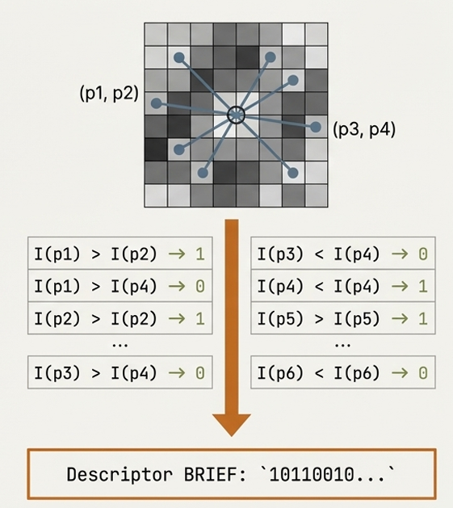


---

#### **Problema de BRIEF: Sensibilidad a la rotación**

El descriptor BRIEF original es **dependiente de la orientación**; si la cámara rota, el patrón fijo de pares cambia, generando descriptores inconsistente para la misma característica física.

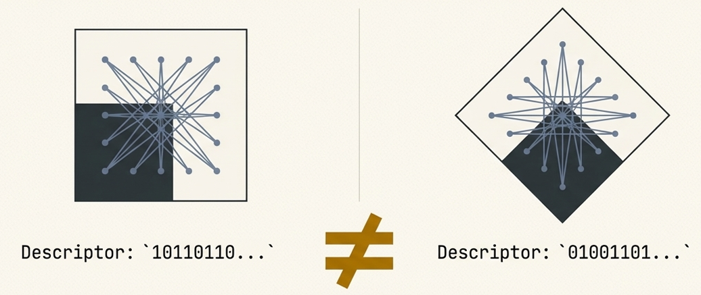


---

#### **La innovación clave de ORB: steered BRIEF**

Para resolver la falta de invariancia a la rotación, ORB introduce:

###### **1. Cálculo de orientación del punto clave**

ORB calcula el ángulo dominante mediante el centroide de intensidades del parche.

###### **2. Rotación del patrón BRIEF**

El patrón de pares de píxeles se rota según el ángulo estimado.

##### **3. Cálculo del descriptor**

Se genera el descriptor BRIEF pero ahora alineado, obteniendo consistencia rotacional.

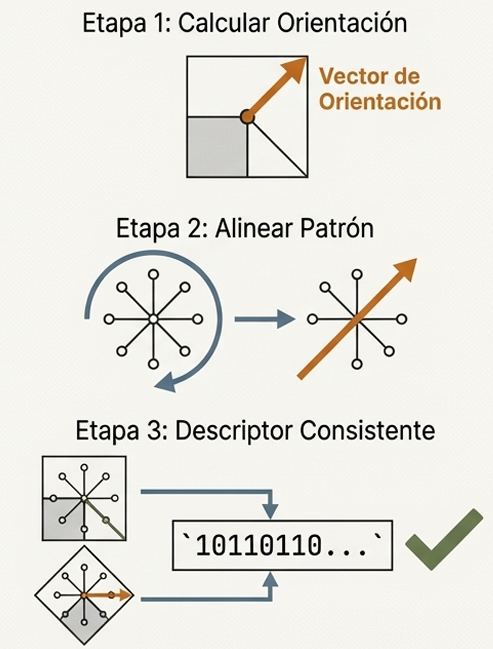


---

#### **ORB en código (OpenCV)**

```python
import cv2

img1 = cv2.imread('image1.png', 0)
img2 = cv2.imread('image2.png', 0)

orb = cv2.ORB_create(nfeatures=2000)

kp1, des1 = orb.detectAndCompute(img1, None)
kp2, des2 = orb.detectAndCompute(img2, None)

matcher = cv2.BFMatcher(cv2.NORM_HAMMING, crossCheck=True)
matches = matcher.match(des1, des2)
matches = sorted(matches, key=lambda x: x.distance)

final = cv2.drawMatches(img1, kp1, img2, kp2, matches[:50], None)

cv2.imshow("Matches", final)
cv2.waitKey(0)
```

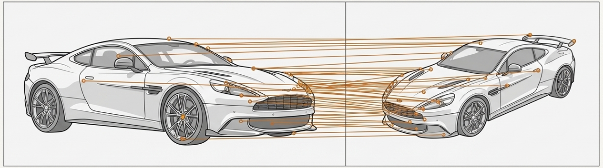

---

### **3. Ventajas frente a técnicas tradicionales**

Comparado con SIFT y SURF, ORB ofrece un equilibrio excepcional entre velocidad, robustez y simplicidad computacional.

#### **Ventajas principales**

* **Velocidad extrema**: apto para video en tiempo real.
* **Libre de patentes**: perfecto para proyectos comerciales y de código abierto.
* **Invariante a rotación y parcialmente a escala**.
* **Descriptores compactos**: ideales para sistemas embebidos, drones y móviles.
* **Matching muy rápido** gracias al uso de descriptores binarios.

#### **Limitaciones**

* Menor robustez en escenas con **poca textura**.
* Menos resistente que SIFT a **cambios fuertes de iluminación**.
* Puede fallar cuando el ruido es significativo.

---

#### **4. Diagrama de flujo ORB**

```text
              Inicio
                |
                v
       Entrada: Imagen en escala de grises
                |
                v
            Detección FAST
       (puntos clave iniciales)
                |
                v
       Cálculo de orientación
     (centroide de intensidades)
                |
                v
     Rotación del patrón BRIEF
   ("steered BRIEF" para invariancia)
                |
                v
         Construcción del
       descriptor binario BRIEF
                |
                v
           Matching Hamming
 (comparación XOR de descriptores)
                |
                v
        Características listas
        para SLAM / AR / Tracking
                |
                v
               Fin
```

---


## **Artículo #3: SLAM_Enseñando_a_una_Máquina_a_Navegar**

### **1. Problema que aborda**

SLAM (Localización y Mapeo Simultáneos) afronta la paradoja fundamental de la navegación autónoma: para construir un mapa preciso una máquina necesita conocer su ubicación, pero para localizarse necesita un mapa. El objetivo de SLAM es permitir que un agente autónomo (robot, dron, dispositivo AR) construya y mantenga un mapa del entorno mientras estima su propia trayectoria dentro de ese mapa, partiendo de cero y con información sensorial imperfecta y parcial.

El problema incluye:
- Construir un mapa consistente a partir de observaciones locales y ruidosas.  
- Estimar la pose (posición y orientación) del sensor en tiempo real con errores acumulativos reducidos.  
- Asociar correctamente observaciones (data association) para identificar cuando se vuelve a visitar un lugar.  
- Detectar y corregir la deriva (drift) que aparece por la integración acumulada de errores locales.  
- Operar con recursos limitados y en entornos dinámicos o parcialmente observables.

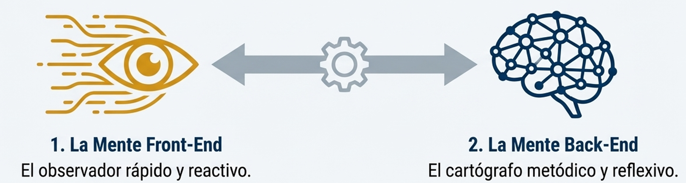

---

### **2. Flujo de operación (pipeline)**

#### Mente Front-End: observador reactivo (procesamiento por fotograma)


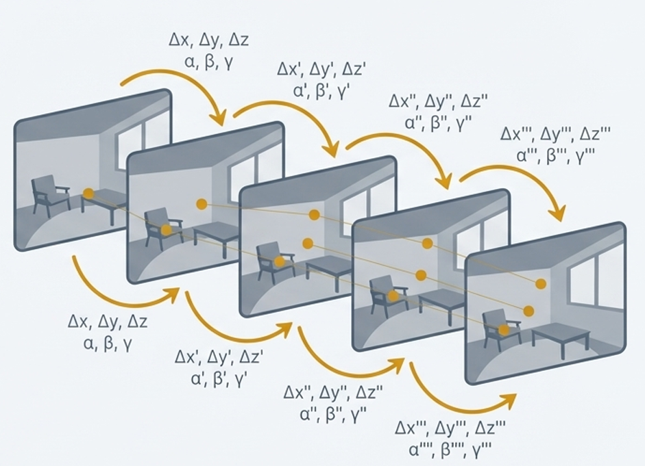


El front-end procesa cada fotograma a medida que llega para estimar el movimiento incremental (odometría visual) y producir observaciones que alimentan el mapa local.

Extracción y correspondencia de características  
- Se extraen puntos clave visuales (keypoints) y se calculan descriptores (por ejemplo, ORB).  
- Se buscan correspondencias entre el fotograma actual y fotogramas previos o keyframes para establecer observaciones 2D–2D.  

Estimación de pose relativa y filtrado de outliers  
- Con las correspondencias se estima la relación geométrica entre vistas: cálculo de la Matriz Esencial o Fundamental para obtener R y t (usando RANSAC para eliminar correspondencias erróneas).  
- La estimación incremental (pose relativa) permite actualizar la trayectoria estimada frame a frame.

Triangulación y creación de puntos 3D  
- Conociendo poses relativas, se triangulan puntos 3D a partir de observaciones 2D en múltiples vistas.  
- Estos puntos iniciales forman la nube de mapa local que el sistema irá refinando.

Deriva (drift) del front-end  
- Las estimaciones por fotograma contienen errores pequeños que se acumulan; sin corrección, la trayectoria y el mapa se vuelven inconsistentes.

#### Mente Back-End: cartógrafo reflexivo (optimización global)
El back-end corrige la deriva y construye un mapa globalmente consistente mediante optimización sobre una estructura de grafo.

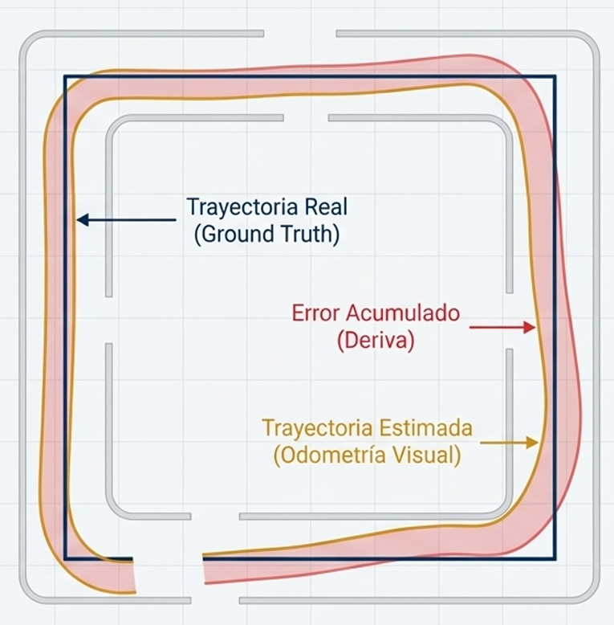

Representación en grafo de poses  
- Se construye un grafo donde cada nodo es una pose (keyframe) y cada arista es una restricción relativa (observación entre poses o entre pose y punto).  

Detección de cierre de bucle (loop closure)  
- El sistema realiza reconocimiento de lugares (place recognition), por ejemplo con Bag-of-Words (BoW), para detectar si el lugar actual coincide con uno ya visitado.  
- Encontrar un bucle añade una restricción de largo alcance que conecta dos nodos distantes en el grafo.

Optimización del grafo y corrección global  
- Tras detectar cierres de bucle, se ejecuta una optimización (pose graph optimization) que redistribuye el error acumulado sobre toda la trayectoria, alineando el mapa.  
- El bundle adjustment (BA) actúa como refinamiento final: optimiza simultáneamente todas las poses y las posiciones 3D para minimizar el error de reproyección total.

Refinamiento periódico y mantenimiento del mapa  
- El sistema puede realizar optimizaciones periódicas, purgar puntos poco fiables, y gestionar la persistencia/compresión del mapa para escalabilidad.

#### Integración y ciclo completo
- El front-end proporciona observaciones y estimaciones rápidas que permiten navegación inmediata.  
- El back-end corrige periódicamente la historia completa, mejorando la consistencia del mapa y la precisión de la localización.  
- Sistemas modernos (por ejemplo ORB-SLAM, ORB-SLAM2, ORB-SLAM3) integran estos componentes y añaden funcionalidades como soporte estéreo, visual-inercial y relocalización robusta.

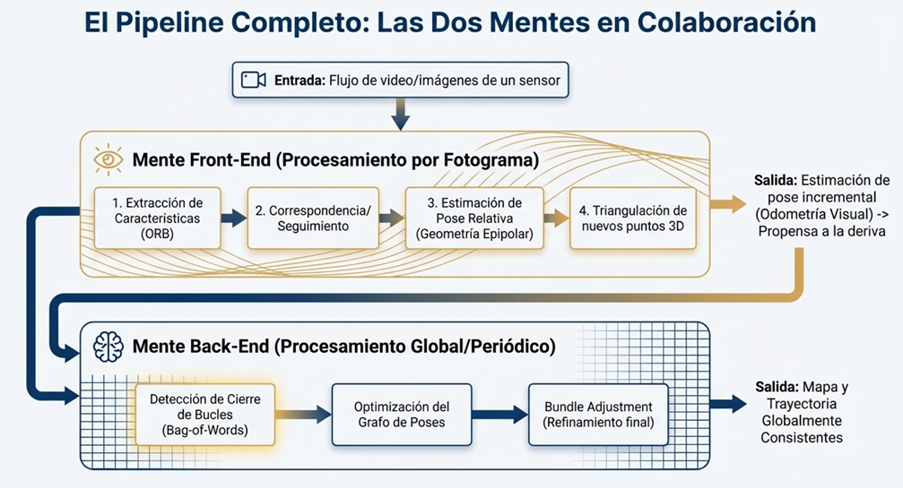

---

### **3. Ventajas frente a técnicas tradicionales**

SLAM aporta la capacidad de construir mapas y localizarse simultáneamente sin infraestructura previa (p. ej. sin GPS o mapas preexistentes), lo que habilita autonomía en una amplia gama de plataformas y entornos.

Ventajas principales:
- Autonomía completa en entornos desconocidos: permite navegación y mapeo sin dependencia de infraestructura externa.  
- Robustez frente a pérdidas temporales de observación: la combinación de front-end reactivo y back-end optimizador reduce la sensibilidad a fallos locales.  
- Versatilidad: se aplica en robótica doméstica, robótica móvil, vehículos autónomos, AR/MR y reconstrucción 3D.  
- Mejora con sensores múltiples: la integración visual-inercial o cámara estéreo reduce ambigüedades y mejora la precisión métrica.  
- Escalabilidad y corrección global: la detección de cierre de bucle y la optimización de grafo corrigen errores acumulados que los métodos puramente locales no pueden remediar.

Limitaciones y consideraciones:
- Ambigüedad de escala en monocular puro: sin sensores adicionales la escala del mapa es indeterminada.  
- Sensibilidad en entornos con poca textura o muy dinámicos: la extracción y el matching de características falla si no hay puntos distintivos o si el entorno cambia.  
- Coste computacional del refinamiento global (bundle adjustment) en mapas grandes: requiere estrategias de subsampling o ventanas de optimización.  
- Necesidad de buenas políticas de data association para evitar asociaciones erróneas que dañen la optimización.

---

### **4. Diagrama de flujo del pipeline SLAM**

```text
                         Inicio
                           |
                           v
                 Flujo de imágenes (sensor)
                           |
                           v
                   Front-End (por frame)
                           |
        ---------------------------------------------
        |                 |                        |
        v                 v                        v
 Extracción de     Correspondencia de      Estimación incremental
 características        descriptores            de pose (R, t)
   (ORB, SIFT...)        (matching)            (RANSAC, Essential)
        |                 |                        |
        v                 v                        v
    Puntos 2D      Parejas 2D-2D/2D-3D ----> Triangulación de puntos 3D
        |                                         |
        v                                         v
  Mapa local (puntos 3D)                    Trayectoria estimada
        |                                         |
        v                                         v
    Inserción de keyframe ------------------------> Alimenta Back-End
                           |
                           v
                     Back-End (periódico)
                           |
            Detección de cierre de bucle (BoW)
                           |
                           v
               Añadir restricción al grafo de poses
                           |
                           v
           Optimización del grafo de poses (pose graph)
                           |
                           v
                 Bundle Adjustment (refinamiento)
                           |
                           v
            Mapa y trayectoria globalmente consistentes
                           |
                           v
                       Salida / Aplicaciones
          (Navegación, Relocalización, AR, Reconstrucción 3D)
                           |
                           v
                          Fin


