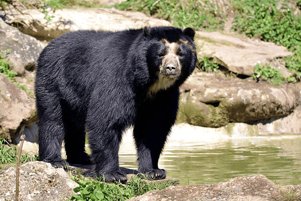

# Punto 1 – Python

 En la carpeta `python/` se encuentra el notebook `examen_final_python.ipynb` con el proceso completo aplicado a la imagen del oso de anteojos, un animal en peligro de extinción colombiano.

 Los GIFs generados se encuentran en `python/gifs/`:

 - `filters.gif` — muestra la secuencia: antes -> suavizado -> realce -> detección de bordes.

 

 - `morphs.gif` — muestra la secuencia: binarizada -> apertura -> cierre.

  

## **Breve explicación:**

Aplicamos filtros de suavizado (Gaussian, median) y realce (unsharp, sobel) para observar cómo cambian la percepción de textura y bordes en la imagen del oso. 

Posteriormente binarizamos la imagen y aplicamos operaciones morfológicas (apertura y cierre) para limpiar ruido y conectar regiones. Los GIFs facilitan comparar el antes y después.

## Punto 2 – Three.js

En la carpeta threejs/ se encuentra el proyecto completo de la escena 3D creada con Three.js.
Incluye: geometrías básicas, texturas, iluminación mejorada, animaciones, dos cámaras y OrbitControls.

### **Indicaciones**

- 1. Entrar a la carpeta del proyecto
cd threejs

- 2. Instalar dependencias
npm install

- 3. Ejecutar el servidor de desarrollo
npm run dev

**Vite mostrará una URL como:**

http://localhost:5173/

### **Estructura del proyecto**
threejs/
│
├── index.html
├── vite.config.js
├── package.json
├── src/
│   ├── main.js
│   └── textures/
│       ├── wood.jpg
│       └── mwool.jpg
│
└── gifs/
    ├── perspectives.gif
    ├── animation.gif
    └── orbitcontrols.gif

### **Qué se implementó**

**Dos cámaras y cambio de perspectiva**
- camera1 → vista principal.
- camera2 → vista zenital desde arriba.

Se puede alternar entre cámaras usando:

- Botón "Cambiar perspectiva"
- Tecla P

**Animación continua**
- Rotación suave del grupo central (sculpture).
- Tres esferas orbitando en círculo 3D perfecto, ahora más alejadas del mástil.

**Movimiento vertical sinusoidal para dar un efecto de rebote.**

**Texturas aplicadas**

- wood.jpg → piso (plano grande con repetición en mosaico).
- wool.jpg → esferas de lana

Esto permite distinguir visualmente qué objetos usan cada textura.

**Iluminación mejorada**

Para evitar que la escena se vea oscura, se agregó un set completo de luces:

- AmbientLight para luz global.
- HemisphereLight para luz suave tipo cielo.
-   DirectionalLight como luz principal estilo “sol”.

### **Evidencias**

  
  